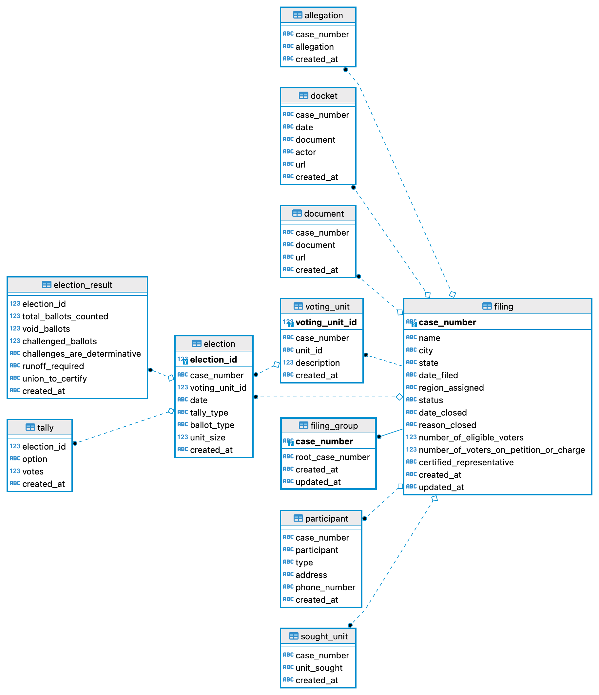

# National Labor Relations Board Cases
[](https://github.com/labordata/nlrb-data/actions/workflows/build.yml)

Daily refreshed data on [representation cases from nlrb.gov](https://www.nlrb.gov/search/case). Data is updated nightly at about 10:00 pm Eastern.

- [sqlite database](https://labordata.github.io/nlrb-data/nlrb.db.zip)
- [CSV exports of tables](https://labordata.github.io/nlrb-data/nlrb-csv.zip)

This repository contains code to build and update a database of representation certification cases published on the National Labor Relations Board's website. This diagram shows the different tables and variables contained in the database.



## Data Limitations
1. This database only contains representation cases, and no unfair labor cases, yet. We may extend the database to cover more types of cases in the future.
2. The data starts around 2010. See https://github.com/labordata/nlrb-cats/ for data from the previous system
3. The update process starts by downloading a CSV of all the cases within a specified time period from the nlrb.gov website. However, repeatingly requesting the same information from nlrb.gov results in spreadsheets with slightly different contents. We might be a bit out of date if the last CSV we downloaded missed a recent case.

## To run yourself
System requirements: 
* wget
* unzip
* sqlite3>=3.3
* python>=3
* jq
* libxml2
* libxsl
* grep
* cat
* tr
```bash
pip install -r requirements.txt
make
```
